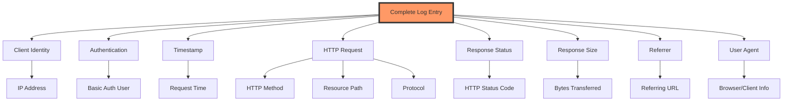
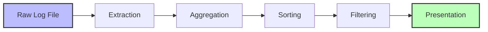
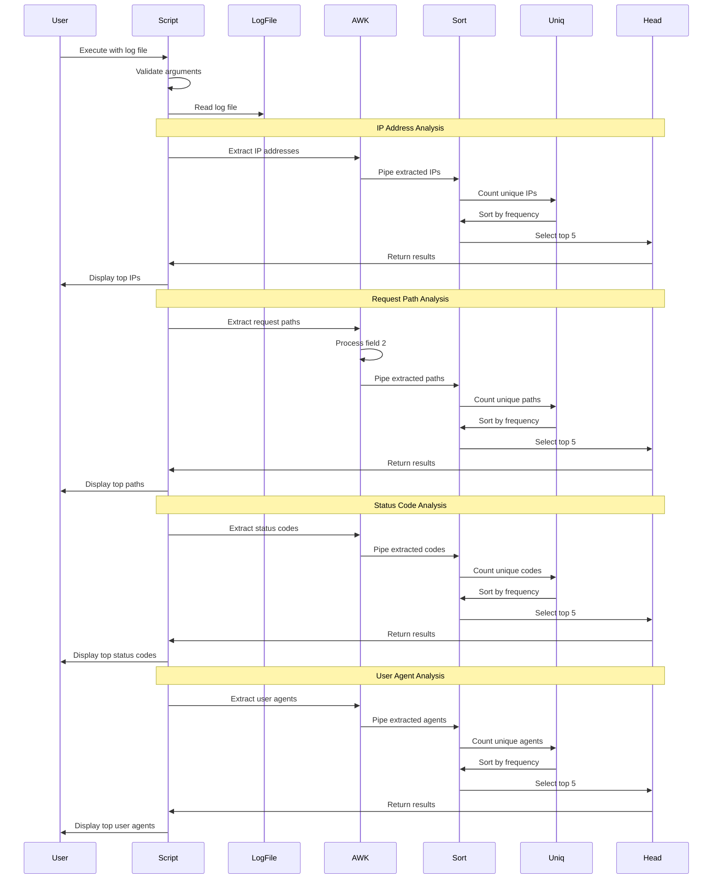
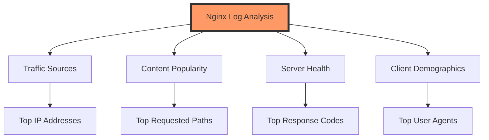
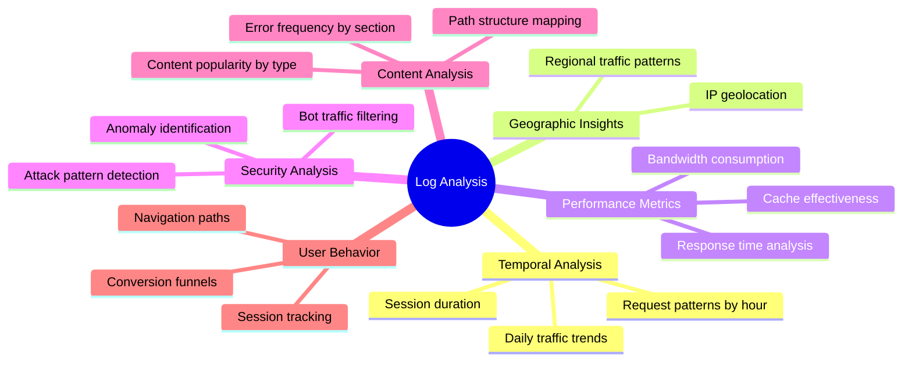

# Deconstructing Web Server Logs: A First Principles Approach to Log Analysis

## Introduction

In the world of web server operations, log files represent the ground truth of what's happening on your servers. Every request, response, error, and interaction is meticulously recorded, creating a treasure trove of operational intelligence waiting to be unlocked. Yet, the sheer volume and cryptic format of these logs make them inaccessible without proper analysis techniques.

This blog post explores the fundamental principles behind log analysis, specifically focusing on Nginx access logs. By taking a first principles approach, we'll deconstruct not just how to analyze logs, but why certain patterns and methodologies yield valuable insights that can transform raw data into actionable information.

## Understanding Web Server Logs from First Principles

### The Anatomy of a Log Entry

At its most fundamental level, a web server log entry is an event record that captures a specific interaction between a client and a server. Let's break down the standard Nginx combined log format from first principles:

```
127.0.0.1 - frank [10/Oct/2023:13:55:36 +0000] "GET /index.html HTTP/1.1" 200 2326 "http://example.com/start.html" "Mozilla/5.0 (Windows NT 10.0; Win64; x64)"
```

Each component of this log entry serves a specific purpose:



This structured format represents a deliberate design choice: each field is positioned to capture a specific aspect of the HTTP transaction, creating a comprehensive record that can be parsed and analyzed systematically.

## The Information Theory of Logs

From an information theory perspective, logs represent a form of data compression. Each log entry encodes a complex event (an HTTP transaction with multiple dimensions) into a single line of text. This compression is lossy—not every aspect of the transaction is recorded—but it preserves the most critical information needed for operational analysis.

The challenge lies in extracting and aggregating this information efficiently. This is where our Nginx Log Analyser comes in.

## Architectural Design from First Principles

The architecture of our log analysis tool follows a pipeline pattern, where data flows through a series of transformations:



This pipeline architecture has several inherent advantages:
1. Each stage has a single responsibility
2. Stages can be optimized independently
3. The process can be parallelized if needed
4. New transformations can be added without changing others

Let's explore each component of this architecture in detail.

## Data Extraction: The Foundation of Analysis

The first challenge in log analysis is extracting structured data from semi-structured text. Our tool uses the `awk` command to parse the log format:

```bash
# Extract IP addresses
awk '{print $1}' "$LOG_FILE"

# Extract request paths
awk -F'"' '{print $2}' "$LOG_FILE" | awk '{print $2}'

# Extract status codes
awk '{print $9}' "$LOG_FILE"

# Extract user agents
awk -F'"' '{print $6}' "$LOG_FILE"
```

This approach demonstrates an important principle: effective data extraction requires understanding the structure of your data. By using field separators (`-F'"'`) and positional arguments, we can precisely target specific components of the log entry.

## Aggregation and Frequency Analysis

Once we've extracted the raw fields, we need to count occurrences to understand patterns. The `sort | uniq -c` pipeline is a powerful pattern for frequency analysis:

```bash
awk '{print $1}' "$LOG_FILE" | sort | uniq -c
```

This pattern demonstrates a key principle in data analysis: transforming individual observations into aggregate statistics reveals patterns that are invisible at the individual level.

From a statistical perspective, this is a form of frequency distribution analysis—we're creating a histogram of occurrences to identify the most common values.

## Data Sorting and Selection

After aggregation, we need to prioritize the most significant findings:

```bash
sort -rn | head -5
```

This simple command pair embodies an important analytical principle: ranking and selection help manage information overload. By sorting numerically in reverse order (`-rn`) and limiting results (`head -5`), we focus attention on the most statistically significant patterns.

## The Execution Flow: Sequence and Processing

The complete processing flow of our tool follows this sequence:



This sequence diagram reveals an important architectural pattern: the same data transformation pipeline is applied to different aspects of the log data, creating a consistent analytical approach across dimensions.

## Statistical Insights from Log Analysis

The output of our analysis provides four distinct views into server activity:

1. **Top IP Addresses**: Identifies potential heavy users, bots, or attackers
2. **Top Requested Paths**: Reveals the most popular content or potential targets
3. **Top Response Codes**: Indicates the overall health and common issues
4. **Top User Agents**: Shows which clients/browsers are most common

These four dimensions create a multi-faceted view of server activity:



From a data science perspective, this approach demonstrates the power of dimensional analysis—examining the same dataset through different lenses to reveal complementary insights.

## The Mathematics of Log Analysis

The underlying mathematical principles of our analysis are based on frequency counting and ranking. If we consider the set of all log entries L, and a function f that extracts a specific field (such as IP address) from each entry, the counting process can be expressed as:

For any value v in the range of f, the count C(v) is:

C(v) = |{l ∈ L : f(l) = v}|

We then sort these counts in descending order and select the top k values:

TopK(f, L, k) = First k elements of Sort({(v, C(v)) : v in range of f(L)})

This mathematical formulation reveals that our seemingly simple shell commands are implementing a sophisticated statistical aggregation and ranking algorithm.

## Performance Considerations: The Time-Space Tradeoff

The Unix pipeline architecture of our tool makes an important tradeoff: it processes data sequentially, requiring minimal memory but potentially more CPU time. For most log files, this is an appropriate tradeoff, as it allows analysis of logs too large to fit in memory.

The time complexity of our approach is approximately:

- Extraction: O(n) where n is the number of log entries
- Sorting: O(n log n)
- Counting: O(n)
- Final sorting: O(k log k) where k is the number of unique values
- Selection: O(k)

The dominant factor is the O(n log n) sorting step, which is necessary for the frequency analysis.

## Beyond Basic Analysis: A Path Forward

From our first principles analysis, several natural extensions emerge:



Each of these extensions builds upon the fundamental principles established in our base tool but adds new dimensions of analysis that can provide deeper insights.

## Shell Scripting as a Data Science Tool

It's worth noting that our approach uses basic Unix shell commands to perform what would typically be considered data science tasks:

- Data extraction (awk)
- Aggregation (sort, uniq)
- Sorting and ranking (sort -rn)
- Selection (head)

This demonstrates an important principle: powerful analysis doesn't always require complex tools. The Unix philosophy of "small tools that do one thing well" creates a flexible analytical framework when these tools are combined effectively.

## Conclusion: From Logs to Insight

By approaching log analysis from first principles, we've seen how a seemingly simple task—counting occurrences in a text file—can reveal sophisticated patterns and insights about web server operation. Our Nginx Log Analyser demonstrates how fundamental computational and statistical techniques can transform raw data into actionable intelligence.

The power of this approach lies not just in what it can tell us about our servers today, but in how it establishes a foundation for more sophisticated analysis. By understanding the basic principles of extraction, aggregation, and ranking, we can build increasingly powerful analytical tools that help us understand and optimize our web infrastructure.

In a world increasingly driven by data, the ability to extract meaningful patterns from raw logs is not just a technical skill—it's a competitive advantage. By mastering these fundamental techniques, we unlock the valuable information hidden in plain sight in our server logs.

## About the Author

I'm a DevOps engineer and systems architect passionate about applying first principles thinking to infrastructure analysis and optimization. This project is part of the roadmap.sh learning path for server administration and monitoring.

---

*For more information about log analysis best practices, visit [roadmap.sh/projects/nginx-log-analyser](https://roadmap.sh/projects/nginx-log-analyser)*
